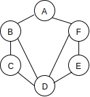
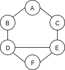

# Graph Traversal

Visit every vertex in a graph.
Unlike a tree:
* We need to specify a starting vertex
* There is no guarantee to have a unique path


## 1. Graph Traversal Applications

* Peer to peer networking
* Web crawlers
* Finding "closest" matches/recommendations
* Shortest path problems
    * GPS Navigation
    * Solving mazes
    * AI (shortest path to win the game)


## 2. Depth First Traversal (DFS)

**Depth first** means to  explore as far as possible down one branch before "backtracking".

In the case of a **graph**, this means visiting one neighbor, then that
neighbor's neighbor, etc., before tracking back to the starting vertex's other neighbors.




For the above graph, one DFS traversal result could be: 
A -> B -> C -> D -> E -> F

### Implementation

For the following sample graph



```js
Graph {
    adjacencyList: {
        A: ["B", "C"].
        B: ["A", "D"],
        C: ["A", "E"],
        D: ["B", "E", "F"],
        E: ["C", "D", "F"],
        F: ["D", "E"]
    }
}
```

One DFS result should be ["A", "B", "D", "E", "C", "F"]

#### (1) Recursive DFS

##### i. Pseudo code

```python
DFS(vertex):
    if vertex is empty
        return // this is the base case
    add vertex to results list
    mark vertex as visited
    for each neighbor in vertex's neighbors:
        if neighbor is not visited:
            DFS(neighbor) // call recursively
```

##### ii. More detailed pseudo code:

1. Write DFS function which accepts a starting vertex
2. Create a list to store the result, which will be returned at the very end
3. Create an object to store visited vertices
4. Write a helper function (a closure to persist data) which accepts a vertex
    1. Should return early if the vertex is empty
    2. Should place the vertex in the visited object, and push the vertex in the result list
    3. Loop over all of the values in the adjacencyList for that vertex
    4. If any of those vertices are not yet in the visited object, recursively call itself with that vertex
5. Invoke the helper function with the starting vertex


##### iii. JS implementation

```js
class Graph{
    // constructor and other Graph class methods ...

    DFS(startV) {
        const result = []; // stores visited vertex name
        const visited = {}; // stores if a vertex is already visited
        const adjacencyList = this.adjacencyList;
        (function dfs(v) {
            if(!v){
                return;
            }
            visited[v] = true;
            result.push(v);
            const neighbors = adjacencyList[v];
            neighbors.forEach(neighbor => {
                if(!visited[neighbor]) {
                    dfs(neighbor);
                }
            });
        })(startV);
        return result;
    }
}
```

#### (2) Iterative DFS

##### i. Pseudo code

```python
DFS_iterative(startVertex):
    let S be a stack (last in first out)
    S.push(startVertex)

    while S is not empty:
        vertex = S.pop()

        if vertex is not visited:
            visit vertex (add to result list)
            label vertex as visited
            for each of vertex's neighbors N do:
                S.push(N)
```

##### ii. More detailed pseudo code

1. Write the function which accepts a starting node
2. Create a stack to help keep track of vertices (use a list/array)
3. Create a list to store the end result, to be returned at the end of the function
4. Create an object to track visited vertices
5. Add the starting vertex to the stack, mark it visited
6. While the stack has something in it:
    1. Pop the next vertex from the stack
    2. If that vertex is not visited yet:
        1. Mark it as visited
        2. Add it to the result list
        3. Push all its neighbors into the stack

##### iii. JS implementation

* The result will be different from the recursive solution, but still depth first (only from another direction)

```js
class Graph {
    //constructor and other Graph class methods ...

    DFS_iterative(startV) {
        const stack = [startV];
        const result = [];
        const visited = {};

        while(stack.length) {
            const v = stack.pop();
            if(visited[v]) continue;

            result.push(v);
            visited[v] = true;

            this.adjacencyList[v].forEach(neighbor => {
                stack.push(neighbor);
            });
        }
        return result;
    }
}
```

## 3. Breadth First Traversal (BFS)

Visit all neighbors first, then go down to the next depth.

### i. pseudo code

Use a queue (first in first out)
1. Write a function accepting a starting vertex
2. Create a queue (using an array) and place the starting vertex in it
3. Create an array to store the result
4. Create an object to track visited vertices
5. While the queue is not empty:
    1. shift to get the first vertex out of it
    2. put it in the result list
    3. mark it as visited
    4. for all its neighbors in the adjacencyList:
        1. if it is not visited yet
            1. push it into the queue
6. return the result array

### ii. JS implementation

```js
class Graph {
    //constructor and other Graph class methods ...

    BFS(startV){
        const queue = [startV];
        const result = [];
        const visited = {};

        while(queue.length){
            const v = queue.shift();
            if(visited[v]) continue;

            result.push(v);
            visited[v] = true;
            this.adjacencyList[v].forEach(neighbor => {
                queue.push(neighbor);
            })
        }

        return result;
    }
}
```