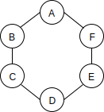

# 2019.2.24, 3.13 Graph

## I. What is a Graph?
A **graph data structure** consists of a finite (and possibly mutable)
set of vertices (or nodes or points), together with a set of unordered
pairs of these vertices for an **undirected graph** or a set of ordered
pairs for a **directed graph**.

* Nodes (=Vertices) + Connections (=Edges)
  
 

* Trees are special Graphs:
  A **tree** is an **undirected graph** in which any two vertices are
  connected by exactly one path.

### Real World Application of Graphs

- Social Networks (Facebook)
- Location / Mapping (Google Maps)
- Routing Algorithms (Network)
- Visual Hierarchy (Visualization of the social network)
- File System Optimizations
- Recommendations (People also watched, People you might know...)
    - Items that share a lot of feature nodes are recommended

### Terminologies

- Vertex (Node)
- Edge

### Types of Graphs

- Undirected Graph


- Directed Graph


- Weighted Graph


- Weighted Directed Graph


## Implement a Graph in JS

### i Two standard approaches

For the graph:


Vertices: A, B, C, D, E, F
Edges: AB, BC, CD, DE, EF, FA

#### 1. Adjacency Matrix

*Matrix: a two dimensional data structure that usually implemented with
nested arrays

Visualization of the above graph's adjacency matrix:
|   | A | B | C | D | E | F |
|---|---|---|---|---|---|---|
| A | 0 | 1 | 0 | 0 | 0 | 1 |
| B | 1 | 0 | 1 | 0 | 0 | 0 |
| C | 0 | 1 | 0 | 1 | 0 | 0 |
| D | 0 | 0 | 1 | 0 | 1 | 0 |
| E | 0 | 0 | 0 | 1 | 0 | 1 |
| F | 1 | 0 | 0 | 0 | 1 | 0 |

Nested array implementation:
```js
[[0, 1, 0, 0, 0, 1], [1, 0, 1, 0, 0, 0], [0, 1, 0, 1, 0, 0], [0, 0, 1,
0, 1, 0], [0, 0, 0, 1, 0, 1], [1, 0, 0, 0, 1, 0]]
```

- The adjacency matrix of an **undirected graph** is **symmetrical**
- The adjacency matrix of a **directed graph** is **unsymmetrical**

#### 2. Adjacency List

Use a key-value object (or Map) to implement an adjacency list

For the same graph


```js
{
  "A": ["B", "F"],
  "B": ["A", "C"],
  "C": ["B", "D"],
  "D": ["C", "E"],
  "E": ["D", "F"],
  "F": ["E", "A"]
}
```

#### 3. Compare Adjacency List and Adjacency Matrix

|V| - number of vertices
|E| - number of edges

| OPERATION | ADJACENCY LIST | ADJACENCY MATRIX |
|---|---|---|
| Add Vertex | O(1) | O(\|V\|^2) |
| Add Edge | O(1) | O(1) |
| Remove Vertex | O(\|V\| + \|E\|) | O(\|V\|^2) |
| Remove Edge | O(\|E\|) | O(1) |
| Query | O(\|V\| + \|E\|) | O(1) |
| Storage | O(\|V\| + \|E\|) | O(\|V\|^2) |

##### Adjacency List

- Can take up **less space** in the case of sparse graphs
- Is faster to iterate over edges (since only existing edges are stored)
- Can be slower to look up a specific edge

##### Adjacency Matrix

- Takes up **more space** in the case of sparse graphs (one more vertex means one more row as well as one more column)
- Slower to iterate over edges
- Faster to look up a specific edge


Real-world data tends to be big and sparse, so we choose **Adjacency
List**.

### ii. Implementation code

#### 1. The base class

```js
class Graph {
  constructor() {
    this.adjacencyList = {};
  }
}
```

#### 2. Add a vertex

(1) takes a vertex name string as parameter
(2) adds it as a key in the adjacencyList
(3) initializes the value to be an empty array for storing edges
connected to it

```js
class Graph{
  ...

  addVertex(name) {
    if(this.adjacencyList[name]) throw new Error('Vertex already exists!');
    this.adjacencyList[name] = [];
  }
} 
```

#### 3. Add an edge

(1) takes two vertex names v1, v2
(2) finds in the adjacencyList the key v1, pushes v2 in the value
array
(3) finds in the adjacencyList the key v2, pushes v1 in the value array

```js
class Graph {
  ...

  addEdge(v1, v2) {
    if(!this.adjacencyList[v1]) throw new Error(`Vertex ${v1} does not exist!`);
    if(!this.adjacencyList[v2]) throw new Error(`Vertex ${v2} does not exist!`);
    this.adjacencyList[v1].push(v2);
    this.adjacencyList[v2].push(v1);
  }
}
```

#### 4. Remove an edge

(1) accepts two vertex names v1, v2
(2) finds v1 in the adjacencyList, remove v2 from its value array
(3) finds v2 in the adjacencyList, remove v1 from its value array

```js
class Graph {
  ...

  removeEdge(v1, v2) {
    if(!this.adjacencyList[v1]) throw new Error(`Vertex ${v1} does not exist!`);
    if(!this.adjacencyList[v2]) throw new Error(`Vertex ${v2} does not exist!`);
    this.adjacencyList[v1] = this.adjacencyList[v1].filter(v => v !== v2);
    this.adjacencyList[v2] = this.adjacencyList[v2].filter(v => v !== v1);
  }
}
```
#### 5. Remove a vertex

(1) accepts a vertex name
(2) go through each vertex (v1) other vertices' in this vertex's adjacencyList value arrays, remove
edge between v and v1
(3) remove the vertex from adjacencyList

```js
class Graph {
  ...

  removeVertex(v) {
    if(!this.adjacencyList[v]) throw new Error(`Vertex ${v} does not exist!`);
    while(this.adjacencyList[v].length){
      const v1 = this.adjacencyList[v].pop();
      this.removeEdge(v, v1);
    }
    delete this.adjacencyList[v];
  }
}
```
