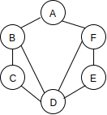
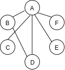
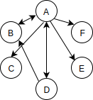

# 2019.2.24 Graph

## I. What is a Graph?
A **graph data structure** consists of a finite (and possibly mutable)
set of vertices (or nodes or points), together with a set of unordered
pairs of these vertices for an **undirected graph** or a set of ordered
pairs for a **directed graph**.

* Nodes (=Vertices) + Connections (=Edges)
  
 

* Trees are special Graphs:
  A **tree** is an **undirected graph** in which any two vertices are
  connected by exactly one path.

## Real World Application of Graphs

- Social Networks (Facebook)
- Location / Mapping (Google Maps)
- Routing Algorithms (Network)
- Visual Hierarchy (Visualization of the social network)
- File System Optimizations
- Recommendations (People also watched, People you might know...)
    - Items that share a lot of feature nodes are recommended

## Terminologies

- Vertex (Node)
- Edge

### Types of Graphs

- Undirected Graph

- Directed Graph

- Weighted Graph

- Weighted Directed Graph

